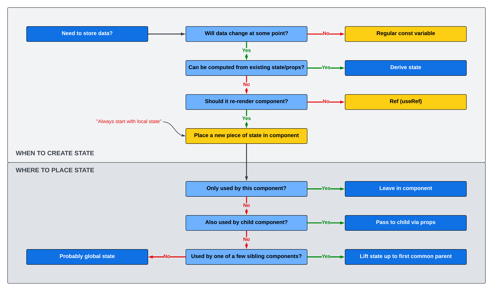

These are not my individual notes on how to work with Javascript and React, but more overall concepts that I think might snag me up later down the line. This document serves to be a quick reference when working with React as a new skill.

# Notes from the React Course

- [Javascript Fundamentals](#javascript-fundamentals)
  - [Destructuring](#destructuring)
  - [Ternaries](#ternaries)
  - [Traditional vs. Arrow Functions](#traditional-vs-arrow-functions)
    - [Traditional Function](#traditional-function)
    - [Arrow Function](#arrow-function)
  - [Template literals](#template-literals)
  - [Short circuiting](#short-circuiting)
    - [&& Operator](#-operator)
    - [|| operator](#-operator)
    - [Nullish coalescing operator](#nullish-coalescing-operator)
  - [Array Methods](#array-methods)
    - [Map](#map)
    - [Filter](#filter)
    - [Array Method Chaining](#array-method-chaining)
    - [Reduce](#reduce)
    - [Sort](#sort)
    - [Immutable Arrays](#immutable-arrays)
  - [Promises](#promises)
  - [Async/Await](#asyncawait)
- [React](#react)
  - [Thinking in React](#thinking-in-react)
    - [The "Thinking in React" Process](#the-thinking-in-react-process)
  - [Prop Passing](#prop-passing)
  - [State](#state)
    - [What's the Difference Between _State_ and _Props_?](#whats-the-difference-between-state-and-props)
    - [Declare a State Variable](#declare-a-state-variable)
    - [Updating State](#updating-state)
    - [State Management](#state-management)
    - [Types of State (Local v Global)](#types-of-state-local-v-global)
      - [Local State](#local-state)
      - [Global State](#global-state)
    - [When and Where to Use State](#when-and-where-to-use-state)
    - [Lifting State](#lifting-state)
    - [Derived State](#derived-state)
    - [Tips and Guidelines (State)](#tips-and-guidelines-state)
  - [Components](#components)
    - [Passing Props in Nested Components](#passing-props-in-nested-components)
    - [Managing Components in Separate Files](#managing-components-in-separate-files)
- [Miscellaneous Notes](#miscellaneous-notes)
  - [Inline CSS](#inline-css)
  - [Render Arrays with a Key](#render-arrays-with-a-key)
  - [Trick for Dynamic Array Creation](#trick-for-dynamic-array-creation)
  - [Prevent Reload when Submitting a Form](#prevent-reload-when-submitting-a-form)
  - [On Forms vs Buttons](#on-forms-vs-buttons)
  - [Arrow Functions for Calling Functions on Inputs](#arrow-functions-for-calling-functions-on-inputs)
  - [Controlled Elements](#controlled-elements)

_Taken from [The Ultimate React Course 2024: React, Redux & More](https://www.udemy.com/course/the-ultimate-react-course/?kw=react&src=sac&couponCode=KEEPLEARNING). ALL credit goes to [Jonas Schmedtmann](https://github.com/jonasschmedtmann)_

## Javascript Fundamentals

### Destructuring

```
const book = getBook(1);

const title = book.title;
const author = book.author;

const { title, author, pages, publicationDate, genres, hasMovieAdaptation } =
book;

console.log(author, title, genres);

const primaryGenre = genres[0];
const secondaryGenre = genres[1];

const [primaryGenre, secondaryGenre, ...otherGenres] = genres;
console.log(primaryGenre, secondaryGenre, otherGenres);

const newGenres = [...genres, "epic fantasy"];
newGenres;

const updatedBook = {
...book,
// Adding a new property
moviePublicationDate: "2001-12-19",
// Overwriting an existing property
pages: 1210,
};
updatedBook;
```

### Ternaries

```
const pagesRange = pages > 1000 ? "over a thousand" : "less than a thousand";
pagesRange;
// Condition ? if true : if false

console.log(`The book has ${pagesRange} pages`);
```

### Traditional vs. Arrow Functions

#### Traditional Function

```
function getYear(str) {
return str.split("-")[0];
}
```

#### Arrow Function

```
const getYear = (str) => str.split("-")[0];
console.log(getYear(publicationDate));
```

### Template literals

```
const summary = `${title} is a book with ${pages} pages written by ${author} in ${getYear(
publicationDate
)}. The book has${hasMovieAdaptation ? "" : " not"} been adapted as a movie`;
summary;
```

### Short circuiting

#### && Operator

In the case of AND, the expression is evaluated until we get one false result because the result will always be false,
independent of the further conditions.

```
console.log(true && "Something");
console.log(false && "Something");
console.log(hasMovieAdaptation && "This book has a movie");
```

falsy: 0, '', null
if not falsy then truey

#### || operator

In the case of OR, the expression is evaluated until we get one true result because the result will
always be true, independent of the further conditions.

```
console.log(true || "Some string");
console.log(false || "Some string");

console.log(book.translations.spanish);
const spanishTranslation = book.translations.spanish || "NOT TRANSLATED";
spanishTranslation;
```

Optional chaining - the little ?.property, if the ?.property is undefined or null,
the expression short circuits to undefined.

```
function getTotalReviewCount(book) {
const goodreads = book.reviews.goodreads?.reviewsCount ?? 0;
const librarything = book.reviews.librarything?.reviewsCount ?? 0;
return goodreads + librarything;
}

console.log(getTotalReviewCount(book));

// Goes wrong
console.log(book.reviews?.librarything?.reviewsCount || 0);
const countWrong = book.reviews?.librarything?.reviewsCount || "No data!";
countWrong;
```

#### Nullish coalescing operator

The nullish coalescing (??) operator is a logical operator that returns its right-hand
side operand when its left-hand side operand is null or undefined, and otherwise
returns its left-hand side operand.

Useful for when the actual return is zero or null or something else falsey but that falsey value is still a
usable value

```
const count = book.reviews.librarything?.reviewsCount ?? "No Data!";
count;
```

### Array Methods

#### Map

Loops over an array and RETURNS A NEW ARRAY after applying some function to it.

```
const books = getBooks();
books;

const x = [1, 2, 3, 4].map((el) => el \* 2);
x;

const titles = books.map((book) => book.title);
titles;

const essentialData = books.map((book) => ({
title: book.title,
author: book.author,
}));
essentialData;
```

#### Filter

Filter out some elements of the array based on a condition

```
const longBooks = books.filter((book) => book.pages > 500);
longBooks;
```

#### Array Method Chaining

```
const longBooks = books
.filter((book) => book.pages > 500)
.filter((book) => book.hasMovieAdaptation);
longBooks;

const adventureBooks = books
.filter((books) => books.genres.includes("adventure"))
.map((book) => book.title);
adventureBooks;
```

#### Reduce

Reduces the entire array into one value

Executes a user-supplied "reducer" callback function on each element of the array, in order, passing in the return value from the calculation on the preceding element. The final result of running the reducer across all elements of the array is a single value.

```
const pagesAllBooks = books.reduce((acc, book) => acc + book.pages, 0);
pagesAllBooks;
```

acc is the accumulator, the current value of the final value we're reducing the array down to, starts at the starting value in our case above, starter is 0.

#### Sort

Sort an array

```
const n = [10, 4, 35, 34, 79, 86, 125000, 42];
const sorted = n.sort((a, b) => a - b);
sorted;
```

a and b are the current and next value respectively, in the callback function, when you get a negative value then the two numbers are sorted in an ascending way (smallest in a largest in b), b - a is descending sort.

Sort changes the original array, however we do not usually want to mutate the data, so take a copy first.

```
const n = [10, 4, 35, 34, 79, 86, 125000, 42];
const sorted = n.slice().sort((a, b) => a - b);
sorted;
n;

const sortedByPages = books.slice().sort((a, b) => b.pages - a.pages);
sortedByPages;

```

#### Immutable Arrays

Working with arrays without changing the source data

1.  Add a book object to array

```
const newBook = {
id: 6,
title: "Harry Potter and the Chamber of Secrets",
author: "J.K. Rowling",
};
const booksAfterAdd = [...books, newBook];
booksAfterAdd;
```

2.  Delete book object from array

```
const booksAfterDelete = booksAfterAdd.filter((book) => book.id !== 3);
booksAfterDelete;
```

3.  Update a book object in the array

```
const booksAfterUpdate = booksAfterDelete.map((book) =>
book.id === 1 ? { ...book, pages: 1 } : book
);
booksAfterUpdate;
```

### Promises

Javascript does not wait for the fetch to complete, this is called a promise.
the .then is run once the promise is fulfilled, which itself returns another promise.

```
fetch("https:jsonplaceholder.typicode.com/todos")
.then((response) => response.json())
.then((data) => console.log(data));

```

### Async/Await

With the await keyword in an async function, we pause the code inside the function and wait on the previous async. When calling the function the rest of the code proceeds as normal, but pausing happens inside the function.

```
async function getTodos() {
const response = await fetch("https:jsonplaceholder.typicode.com/todos");
const data = await response.json();
console.log(data);
return data;
}
getTodos();
```

if we take the output of the async function we make another promise that requires the .then methods all over again
so do all the things inside the async function rather than doing all the return and .then redundancy.

```
const todos = getTodos();
console.log(todos);
```

## React

### Thinking in React

Thinking in react is a core skill. Need to learn how to work with the react API and think in react in order to get in the "react mindset". Thinking in react means having a good mental model about using components, state, data flow, effects, etc. It's also about think in state transitions rather than element mutations.

#### The "Thinking in React" Process

This is not a rigid process, but this is the basic process for thinking in react

1. Break the desired UI into components and establish a component tree.
2. Build a static version in React (without state)
3. Think about state:
   - when to use state
   - what types of state (local v global)
   - where to place each piece of state
4. Establish data flow:
   - One-way data flow
   - Child-to-parent communication
   - Accessing global state

Steps 3 and 4 in the thinking in this process comprise state management.

### Prop Passing

Remember whenever I do prop passing like this:

```
function SkillList() {
  return (
    <div className="skill-list">
      {skills.map((skill) => (
        <Skill skillObject={skill} key={skill.skill} />
      ))}
    </div>
  );
}

function Skill({ skillObject }) {
  return (
    <div className="skill" style={{ backgroundColor: skillObject.color }}>
      <span>{skillObject.skill}</span>
      <span>
        {skillObject.level === "beginner" && "👶"}
        {skillObject.level === "intermediate" && "👍"}
        {skillObject.level === "advanced" && "💪"}
      </span>
    </div>
  );
}
```

That Skill(skillObject) will not return anything, I need to wrap it in curly brackets inside the parens.

### State

#### What's the Difference Between _State_ and _Props_?

State is internal data owned by the component, props are external data owned by the parent component.

Props are read-only, but receiving new props causes the component to re-render. Usually when the parent's state has been updated.

Whenever a piece of state is passed as a prop, when the state is changed both components re-render.

While state is used to make components interactive, props are used to give parent comopnents the ability to configure child components. Props can be seen as settings in child components which the parent component can manage.

#### Declare a State Variable

```
const [step, setStep] = useState(1);
```

The hook (second element in the array) should always be set(Something).

#### Updating State

Do not _update_ state manually like this:

```
function handlePrevious() {
    if (step > 1) setStep(step = step + 1);
  }
```

Instead create a callback function for handling state updates and pass the current value like this:

```
function handlePrevious() {
    if (step > 1) setStep((s) => s - 1);
  }
```

This does not apply to setting state, which can be performed directly:

```
setTest({ name: "R3mnan7"});
```

#### State Management

Deciding **when** to create pieces of state, what **types** of state are necessary, **where** to place each piece of state, and how data **flows** through the app.

As an application grows, finding a home for each piece of state is important.

#### Types of State (Local v Global)

_Should always start with local state, and move to global if it's needed_

##### Local State

- State needed only by one or few components.
- State that is defined in a component and **only that component and child components have access to it**

##### Global State

- State that **many components** might need.
- **Shared** state that is accessible to every **component** in the entire application.

#### When and Where to Use State



#### Lifting State

Becasue react uses one-way data flow, when a piece of state must be used by multiple sibling components, you must move/create the piece of state in **the first common parent** of the components. You need to give any components modifying the piece of state a function to perform that modification. Any function acting on the piece of lifted state must be located in the same component as the state variable and passed to the child components as props.

Typical naming convention for the passed function is similar to vanilla JS (on(Verb)(StateVariable)) as shown in the code example below.

```
// Declare the state variable and setter in the default App function and pass the piece of state and any update function as props
export default function App() {
  const [items, setItems] = useState([]);

  function handleAddItems(item) {
    setItems((items) => [...items, item]);
  }

return (
    <div className="app">
      <Logo />
      <Form onAddItems={handleAddItems} /> // The prop for the items state in this case is onAddItems
      <PackingList items={items} />
      <Stats />
    </div>
  );
}

// Read the value from props as normal
function PackingList({ items }) {
  return (
    <div className="list">
      <ul>
        {items.map((item) => (
          <Item item={item} key={item.id} />
        ))}
      </ul>
    </div>
  );
}

// Pass onAddItems as a prop and reference the function like normal
function Form({ onAddItems }) {
  const [description, setDescription] = useState("");
  const [quantity, setQuantity] = useState(1);

  function handleSubmit(e) {
    e.preventDefault();

    if (!description) return;

    const newItem = { description, quantity, packed: false, id: Date.now() };
    console.log(newItem);

    onAddItems(newItem);

    setDescription("");
    setQuantity(1);
  }
```

_Reference the [travel-list](https://github.com/r3mnan7/learn-react/blob/main/my-projects/travel-list/src/components/App.js) project for full context_

#### Derived State

**Derived state** is state that is computer from an existing piece of state, or from props.

_Example_

```
const [cart, setCart] = useState([
  {name: "Pizza Sandwich", price: 3.50},
  {name: "Beer", price: 4.69},
]);
const [numItems, setNumItems] = useState(2);
const [totalPrice, setTotalPrice] = useState(8.19)
```

In this example, the numItems and totalPrice values can be _derived_ from the existing piece of state `cart`, as follows:

```
const [cart, setCart] = useState([
  {name: "Pizza Sandwich", price: 3.50},
  {name: "Beer", price: 4.69},
]);
const numItems = cart.length;
const totalPrice = cart.reduce((acc, cur) => acc + cur.price, 0);
```

The `cart` state acts as a single source of truth for the related data, and when the state change re-renders the componend, the derived values will automatically recalculate.

Sorting one array can be derived from another array.

#### Tips and Guidelines (State)

Each component manages it's own state. Each component instance operates independent from the others.

Use a state variable for any data that the component should keep track of ("remember") over time. **This is data that will change at some point**. In Vanilla JS, that's a let variable, or and [] or {}.

Whenever you want something in the component to be **dynamic**, create a piece of state related to that "thing" and update the state when the "thing" should change.

**_Example_**: A modal window can be opened or closed. So we create a state variable isOpen that tracks wwhether the modal is open or not. In isOpen = true we display the window, on isOpen = false, we hide it.

If you want to change the way a component looks, or the data it displays, **update its state**. This usually happens in an **event handler** function.

When building components, imagine its view as a **reflection of state over time**.

For data that should not trigger component re-renders, **don't use state**. Use a regular variable instead.

Data can only move down the component tree, not up or sideways.

### Components

#### Passing Props in Nested Components

For nested components, you need to pass the function all the way down the tree, **in sequence** (this tripped me up so that's why it's here).

Step 1: Declare the function to pass

```
export default function App() {
  const [items, setItems] = useState([]);


  function handleToggleItem(id) {
    setItems((items) =>
      items.map((item) =>
        item.id === id ? { ...item, packed: !item.packed } : item
      )
    );
  }
```

Step 2: Pass it to the first component as a prop, then to the next component as a prop.

```
function PackingList({ items, onDeleteItem, onToggleItem }) { // HERE
  return (
    <div className="list">
      <ul>
        {items.map((item) => (
          <Item
            item={item}
            onDeleteItem={onDeleteItem}
            onToggleItem={onToggleItem} // AND HERE
            key={item.id}
          />
        ))}
      </ul>
    </div>
  );
}
```

Step 3: Now pass it to it's caller.

```
function Item({ item, onDeleteItem, onToggleItem }) { // HERE
  return (
    <li>
      <input
        type="checkbox"
        value={item.packed}
        onChange={() => onToggleItem(item.id)} // AND HERE
      />
      <span style={item.packed ? { textDecoration: "line-through" } : {}}>
        {item.quantity} {item.description}
      </span>
      <button onClick={() => onDeleteItem(item.id)}>❌&times;</button>
    </li>
  );
}
```

Where I messed this up was passing it to the PackingList as a function param, but not to pass it to item in the line `onToggleItem={onToggleItem}`. You have to destructure the props in packing list, pass to the item component, then destructure it again, then pass it to the JSX.

#### Managing Components in Separate Files

Create separate files under the `src` directory for each component (i.e. `Logo.js`), then write the function as a `export default` function:

```
export default function Logo() {
  return <h1>🌴 Far Away 💼</h1>;
}
```

Then within `App.js` import the function from the file like so:

```
import Logo from "./Logo";
```

Since this is a default function the import can be called anything as long as the same component file is called, for example:

```
import awesomeComponent from "./Logo"
```

Also need to make sure any needed imports are included in the component file (this is pretty obvious, but in case it's not 😊)

_Reference the file structure in [travel-list](https://github.com/r3mnan7/learn-react/blob/main/my-projects/travel-list/src/components/App.js) for more context_

##### Automagic

If an `App.js` has already been created with numerous components, VSCode has a refactor option to create separate files automatically. Simply highlight the entire function, right click > refactor, then click _Move to a new file_.

This may require some manual refactoring, but it saves a step and a lot of work in most cases. Also this method uses named exports, so you'll need to change that (as a common convention, not a hard and fast rule per se).

You can also move all these files to a separate `components` folder (or whatever else you want to call it), making sure to change the import statement within `index.js` when you do.

## Miscellaneous Notes

### Inline CSS

Inline CSS in JSX needs two sets of curly braces:

```
<button style={{ backgroundColor: "#7590F2" }}>Previous</button>
```

### Render Arrays with a Key

When rendering an array in react, you always need to pass in a key, like this:

```
<Skill skillObject={skill} key={skill.skill} />
```

### Trick for Dynamic Array Creation

Can use this trick to create a dynamic array from a range of numbers (probably more uses).

```
<select>
  {Array.from({ length: 20 }, (_, i) => i + 1).map((num) => (
    <option value={num} key={num}>
      {num}
    </option>
  ))}
</select>
```

### Prevent Reload when Submitting a Form

```
  function handleSubmit(e) {
    e.preventDefault();
  }
```

### On Forms vs Buttons

Can make submitting a form easier by using onSubmit in the form rather than using onClick to submit the form, this allows hitting enter to submit rather than _just_ clicking on the button.

### Arrow Functions for Calling Functions on Inputs

When you call a function like below (without arrow function) within an input, it calls the function immediately.

```
<button onClick={onDeleteItem(item.id)}>❌&times;</button>
```

Instead when calling the function on the input, wrap it in an arrow function to ensure the function is only called when the event is triggered

```
<button onClick={() => onDeleteItem(item.id)}>❌&times;</button>
```

### Controlled Elements

By default, input fields maintain their own state inside the DOM. This makes it hard to read their values and leaves their state in the DOM, which is not ideal. In react it is better to keep state in the react app rather than the DOM, to handle this we use controlled elements.

In order to implement controlled elements, follow three steps:

1. Create a piece of state

```
const [description, setDescription] = useState
```

2. Use that state as the value of the input field

```
<input type="text" placeholder="Item..." value={description} />
```

3. Connect the state with the value being input

```
<input
        type="text"
        placeholder="Item..."
        value={description}
        onChange={(e) => setDescription(e.target.value)} // Target returns the element, in our case the input, which we pull the value from.
      />
```

Another example

```
 const [quantity, setQuantity] = useState(1);

 <select value={quantity} onChange={(e) => setQuantity(Number(e.target.value))}>
        {Array.from({ length: 20 }, (_, i) => i + 1).map((num) => (
          <option value={num} key={num}>
            {num}
          </option>
        ))}
      </select>
```

_e.target.value always returns a string_
